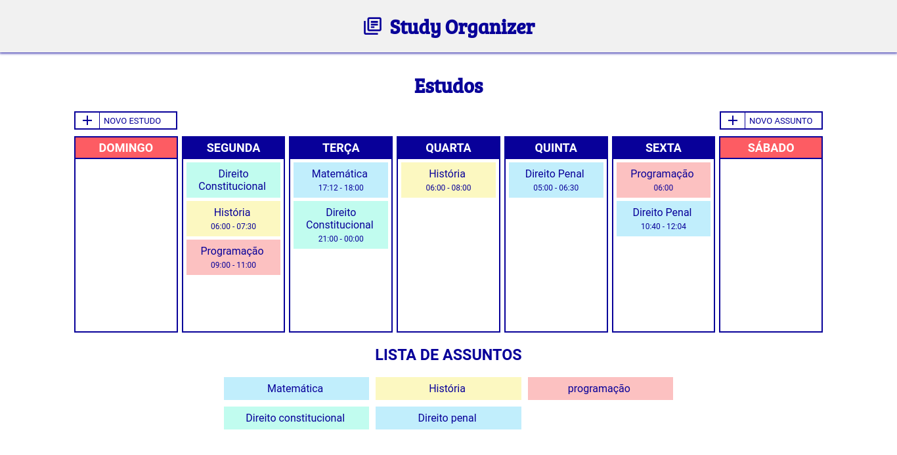

<h1 align="center">
    📚 Study Organizer
</h1>

📑 Um site para organizar seus estudos

 <a href="#objetivo">Objetivo</a> •
 <a href="#funcionalidades">Funionalidades</a> • 
 <a href="#layout">Layout</a> • 
 <a href="#tecnologias">Tecnologias</a> • 

<h4 align="center"> 
	🚧  Em construção...  🚧
</h4>

<h2 id="objetivo">📝 Objetivo</h2>

Como atualmente alguns amigos estão estudando para concurso, resolvi fazer uma aplicação web para organizar os estudos, o intuito é uma aplicação eficiente e simples para ser usada como maneira de organização, planejamento e acompanhamento dos estudos feitos.

<h2 id="funcionalidades">⚙️ Funcionalidades</h2>

- [x] Adicionar assuntos à ser estudada
- [x] Planejar estudos na semana
- [x] Horário de estudo do assunto
- [x] Deletar assuntos e estudos adicionados
- [ ] Histórico mensal de estudos
- [ ] Conteúdos do assunto estudados

<h2 id="layout">🖼️ Layout</h2>

<h1 align="center">
  
</h1>

<h2 id="tecnologias">🛠 Tecnologias</h2>

As seguintes ferramentas foram usadas na construção do projeto:

- [Python](https://www.python.org/)
- [Django](https://www.djangoproject.com/start/overview/)
- [HTML5](https://developer.mozilla.org/pt-BR/docs/Web/HTML)
- [CSS3](https://developer.mozilla.org/pt-BR/docs/Web/CSS)
